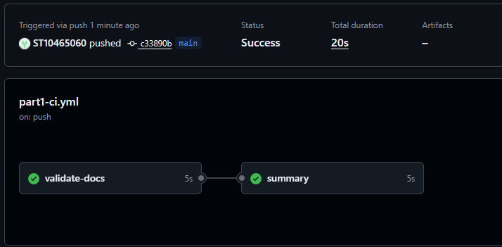

# RaceDay – Event Management System
**PROG6212 Portfolio of Evidence – Part 1**
Student: Eduan Pretorius
Student Number: ST10465060

## Contents
- [System Overview](#system-overview)
- [User Roles](#user-roles)
- [Repository Structure](#repository-structure)
- [Planning Artefacts](#planning-artefacts)
- [Database Setup Instructions](#database-setup-instructions)
- [ERD and Script Consistency](#erd-and-script-consistency)
- [CI/CD Status](#cicd-status)
- [Video Demonstration](#video-demonstration)
- [References](#references)

## System Overview
RaceDay is a web-based race event management system. Organisers publish running
events with multiple distance categories, manage entrants and capture results,
while participants browse events, enter a category and track their own results.

Part 1 covers the system planning phase only: the entity relationship diagram,
the RESTful API endpoint plan and the SQL Server database script. No application
code is implemented in this part. Part 2 will implement the planned API in
ASP.NET Core with Entity Framework Core.

## User Roles
**Organiser** – creates and maintains events, defines the distance categories for
each event, views the entrant list for their events and captures finish times
and positions.

**Participant** – registers an account, browses published events, enters a chosen
category, views and withdraws from their own enrolments and views their results.

## Repository Structure

```
PROG6212-RaceDayPOE-EduanP-ST10465060/
│
├── .github/
│ └── workflows/
│ └── part1-ci.yml
│
├── docs/
│ ├── RaceDay_ERD.pdf
│ ├── RaceDay_API_Endpoint_Plan.pdf
│ ├── RaceDay_Database.sql
│ └── cicd-green-build.png
│
└── README.md
```
## Planning Artefacts

**Entity Relationship Diagram** – seven entities: `Roles`, `Users`, `Venues`,
`Events`, `Categories`, `Enrolments` and `Results`. The many-to-many
relationship between participants and categories is resolved by the
`Enrolments` junction entity, and `Enrolments` to `Results` is one-to-one.

**API Endpoint Plan** – 21 endpoints across authentication, user profiles,
events, categories, enrolments and results. Each entry documents the HTTP
method, route, description, required role, request body and expected response
codes.

**Database Script** – creates `RaceDayDB` and its seven tables with all primary
key, foreign key, unique, default and check constraints, then seeds two
organisers, two participants, three venues, three events, seven categories,
four enrolments and two results.

## Database Setup Instructions

**Prerequisites:** SQL Server 2019 or later and SQL Server Management Studio.
The script uses `DATETIME2` and `SYSUTCDATETIME()`.

1. Open SQL Server Management Studio and connect to your local instance.
2. Open `docs/RaceDay_Database.sql`.
3. Execute the script in full (F5). It drops any existing `RaceDayDB`,
   recreates the seven tables with all constraints and inserts the seed data.
4. The verification query at the end of the script returns four rows joining
   `Enrolments` to `Users`, `Categories` and `Events`, confirming that the seed
   data and foreign keys resolve correctly.

The script is idempotent and may be re-run repeatedly from a clean state.

## CI/CD Status



## Video Demonstration

[RaceDay Part 1 walkthrough (unlisted)](PASTE_YOUR_YOUTUBE_LINK_HERE)

The recording covers the ERD and its relationships, a walkthrough of the API
endpoint plan, a live execution of the database script in SSMS, and the commit
history and CI/CD workflow in GitHub.

## References

Troelsen, A. & Japikse, P. 2022. *Pro C# 10 with .NET 6: Foundational
Principles and Practices in Programming*. 11th ed. Berkeley: Apress.

W3Schools. 2026. *SQL Tutorial*. [Online]. Available at:
https://www.w3schools.com/sql/ [Accessed 31 August 2026].
